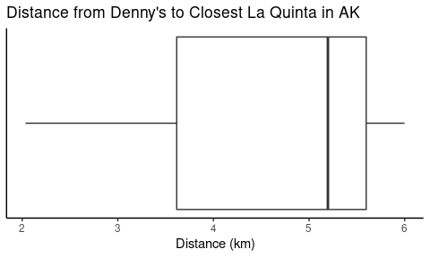
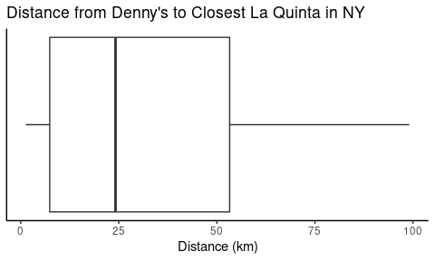
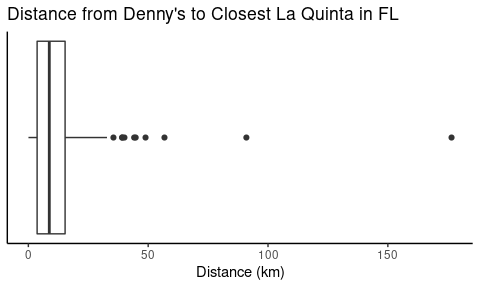

Lab 04 - La Quinta is Spanish for next to Denny’s, Pt. 2
================
Jonathan Klus
21 September 2021

### Load packages and data

``` r
library(tidyverse)
library(dsbox)
library(ggplot2)

knitr::opts_chunk$set(fig.width=unit(5,"cm"), fig.height=unit(3,"cm"))
```

``` r
states = read_csv("data/states.csv")
```

### Exercise 0

``` r
str_c("Here is an incredible, grandiloquent,", 
      "extreme, terrible, verbose, lengthy, awesome-in-the-original-sense,", 
      "no good and very long line (of code).")
```

    ## [1] "Here is an incredible, grandiloquent,extreme, terrible, verbose, lengthy, awesome-in-the-original-sense,no good and very long line (of code)."

``` r
better_variable_name = 0
this_is_a_bad_boolean = TRUE
needs_infix_spacing = 1 * 0^0
this = mtcars %>% 
  mutate(needs = mpg * wt) %>% 
  mutate(to_have = hp / cyl) %>%
  mutate(one = "pipe_step") %>% 
  mutate(per = "line")
```

### Exercise 1

``` r
lint_assignment()
```

    ## lab04.Rmd:15:32: style: Put spaces around all infix operators.
    ## knitr::opts_chunk$set(fig.width=unit(5,"cm"), fig.height=unit(3,"cm"))
    ##                               ~^~
    ## lab04.Rmd:15:40: style: Commas should always have a space after.
    ## knitr::opts_chunk$set(fig.width=unit(5,"cm"), fig.height=unit(3,"cm"))
    ##                                        ^
    ## lab04.Rmd:15:57: style: Put spaces around all infix operators.
    ## knitr::opts_chunk$set(fig.width=unit(5,"cm"), fig.height=unit(3,"cm"))
    ##                                                        ~^~
    ## lab04.Rmd:15:65: style: Commas should always have a space after.
    ## knitr::opts_chunk$set(fig.width=unit(5,"cm"), fig.height=unit(3,"cm"))
    ##                                                                 ^

We get warnings about the pipe operator, spaces between infix operators,
too many characters on a given line, using T instead of TRUE as a
boolean operator.

### Exercise 2

``` r
dn_ak = dennys %>%
  dplyr::filter(state == "AK")
nrow(dn_ak)
```

    ## [1] 3

### Exercise 3

``` r
lq_ak = laquinta %>%
  dplyr::filter(state == "AK")
nrow(lq_ak)
```

    ## [1] 2

### Exercise 4

There are 2 \* 3 = 6 pairings between Denny’s and La Quinta locations in
Alaska.

### Exercise 5

``` r
dn_lq_ak = dplyr::full_join(dn_ak, lq_ak, by = "state")
dn_lq_ak
```

    ## # A tibble: 6 × 11
    ##   address.x   city.x state zip.x longitude.x latitude.x address.y  city.y  zip.y
    ##   <chr>       <chr>  <chr> <chr>       <dbl>      <dbl> <chr>      <chr>   <chr>
    ## 1 2900 Denali Ancho… AK    99503       -150.       61.2 3501 Minn… "\nAnc… 99503
    ## 2 2900 Denali Ancho… AK    99503       -150.       61.2 4920 Dale… "\nFai… 99709
    ## 3 3850 Debar… Ancho… AK    99508       -150.       61.2 3501 Minn… "\nAnc… 99503
    ## 4 3850 Debar… Ancho… AK    99508       -150.       61.2 4920 Dale… "\nFai… 99709
    ## 5 1929 Airpo… Fairb… AK    99701       -148.       64.8 3501 Minn… "\nAnc… 99503
    ## 6 1929 Airpo… Fairb… AK    99701       -148.       64.8 4920 Dale… "\nFai… 99709
    ## # … with 2 more variables: longitude.y <dbl>, latitude.y <dbl>

``` r
nrow(dn_lq_ak)
```

    ## [1] 6

``` r
names(dn_lq_ak)
```

    ##  [1] "address.x"   "city.x"      "state"       "zip.x"       "longitude.x"
    ##  [6] "latitude.x"  "address.y"   "city.y"      "zip.y"       "longitude.y"
    ## [11] "latitude.y"

### Exercise 6

``` r
source("haversine.R")

# calculate distances
dn_lq_ak = dn_lq_ak %>%
  dplyr::mutate(distance = haversine(long1 = longitude.x, 
                                     lat1 = latitude.x,
                                     long2 = longitude.y,
                                     lat2 = latitude.y))
```

### Exercise 7

``` r
dn_lq_ak_mindist = dn_lq_ak %>%
  dplyr::group_by(address.x) %>%
  dplyr::summarise(closest = min(distance))
dn_lq_ak_mindist
```

    ## # A tibble: 3 × 2
    ##   address.x        closest
    ##   <chr>              <dbl>
    ## 1 1929 Airport Way    5.20
    ## 2 2900 Denali         2.04
    ## 3 3850 Debarr Road    6.00

### Exercise 8

``` r
summary(dn_lq_ak_mindist$closest)
```

    ##    Min. 1st Qu.  Median    Mean 3rd Qu.    Max. 
    ##   2.035   3.616   5.197   4.410   5.598   5.998

``` r
ggplot2::ggplot(data = dn_lq_ak_mindist, aes(x = closest)) +
  ggplot2::geom_boxplot() + 
  ggplot2::xlab("Distance (km)") + 
  ggplot2::ggtitle("Distance from Denny's to Closest La Quinta in AK") + 
  ggplot2::theme_classic() +
  ggplot2::scale_y_continuous(breaks = NULL)
```

<!-- -->

Since there are only three Denny’s in the entire state of Alaska, we
have only the distances from these Denny’s to the closest La Quinta to
summarize. The average distance is 4.4 km, and the data are left skewed,
with a median distance of 5.2 km. The furthest one would need to travel
from Denny’s to the closest La Quinta in the state of Alaska is 6 km,
while the closest is just over 2 km.

### Exercise 9: New York

``` r
lq_ny = laquinta %>%
  dplyr::filter(state == "NY")
nrow(lq_ny)
```

    ## [1] 19

``` r
dn_ny = dennys %>%
  dplyr::filter(state == "NY")
nrow(dn_ny)
```

    ## [1] 56

``` r
dn_lq_ny = dplyr::full_join(dn_ny, lq_ny, by = "state") %>% 
    dplyr::mutate(distance = haversine(long1 = longitude.x, 
                                       lat1 = latitude.x,
                                       long2 = longitude.y,
                                       lat2 = latitude.y)) %>%
    dplyr::group_by(address.x) %>%
    dplyr::summarise(closest = min(distance))

summary(dn_lq_ny$closest)
```

    ##    Min. 1st Qu.  Median    Mean 3rd Qu.    Max. 
    ##   1.281   7.381  24.158  33.575  53.265  99.044

``` r
ggplot2::ggplot(data = dn_lq_ny, aes(x = closest)) +
  ggplot2::geom_boxplot() + 
  ggplot2::xlab("Distance (km)") + 
  ggplot2::ggtitle("Distance from Denny's to Closest La Quinta in NY") + 
  ggplot2::theme_classic() +
  ggplot2::scale_y_continuous(breaks = NULL)
```

<!-- -->

There are 56 Denny’s in the state of New York. The average from Denny’s
to La Quinta is 33.6 km, and the data are right skewed, with a median
distance of 24.2 km. The furthest one would need to travel from Denny’s
to the closest La Quinta in the state of /New York is 99 km, while the
closest is 1.3 km. In general, it does not appear that La Quinta is
Spanish for “Next to Denny’s” in the great state of New York.

### Exercise 10: Florida

``` r
lq_fl = laquinta %>%
  dplyr::filter(state == "FL")
nrow(lq_fl)
```

    ## [1] 74

``` r
dn_fl = dennys %>%
  dplyr::filter(state == "FL")
nrow(dn_fl)
```

    ## [1] 140

``` r
dn_lq_fl = dplyr::full_join(dn_fl, lq_fl, by = "state") %>% 
    dplyr::mutate(distance = haversine(long1 = longitude.x, 
                                       lat1 = latitude.x,
                                       long2 = longitude.y,
                                       lat2 = latitude.y)) %>%
    dplyr::group_by(address.x) %>%
    dplyr::summarise(closest = min(distance))

summary(dn_lq_fl$closest)
```

    ##    Min. 1st Qu.  Median    Mean 3rd Qu.    Max. 
    ##   0.044   3.655   8.736  13.483  15.329 176.576

``` r
ggplot2::ggplot(data = dn_lq_fl, aes(x = closest)) +
  ggplot2::geom_boxplot() + 
  ggplot2::xlab("Distance (km)") + 
  ggplot2::ggtitle("Distance from Denny's to Closest La Quinta in FL") + 
  ggplot2::theme_classic() +
  ggplot2::scale_y_continuous(breaks = NULL)
```

<!-- -->

There are 140 Denny’s in the state of Florida. The average from Denny’s
to La Quinta is 13.5 km, and the data are right skewed, with a median
distance of 8.7 km. The furthest one would need to travel from Denny’s
to the closest La Quinta in the state of /New York is 176.5 km, while
the closest is 0.04 miles. In general, it does seems that the distance
between the closest Denny’s and La Quinta in Florida is extremely small
(essentially “next to” each other), while the furthest are separated by
nearly 200 miles. The vast majority of pairs are within 15 miles of each
other, since the 75th percentile is 15.3. So while not literally next to
each other, most Denny’s in Florida are quite close to a La Quinta.

### Exercise 11

Based on our limited analysis above, it seems that Mitch Hedberg’s joke
is most likely to hold true in states that have large numbers of Denny’s
(i.e. FL, TX, CA) and large numbers of La Quinta hotels. In states with
smaller numbers of these establishments (like NY, NC, etc.) the distance
from the nearest La Quinta to the nearest Denny’s tend to be farther
than in states like Florida, which have many more Denny’s restaurants.
It makes sense that the more Denny’s locations a state has, the more
likely one would be to fall within close distance to a La Quinta hotel.

``` r
dennys %>% 
  group_by(state) %>% 
  summarize(n = n()) %>%
  arrange(desc(n))
```

    ## # A tibble: 51 × 2
    ##    state     n
    ##    <chr> <int>
    ##  1 CA      403
    ##  2 TX      200
    ##  3 FL      140
    ##  4 AZ       83
    ##  5 IL       56
    ##  6 NY       56
    ##  7 WA       49
    ##  8 OH       44
    ##  9 MO       42
    ## 10 PA       40
    ## # … with 41 more rows

``` r
laquinta %>% 
  group_by(state) %>% 
  summarize(n = n()) %>%
  arrange(desc(n))
```

    ## # A tibble: 59 × 2
    ##    state     n
    ##    <chr> <int>
    ##  1 TX      237
    ##  2 FL       74
    ##  3 CA       56
    ##  4 GA       41
    ##  5 TN       30
    ##  6 OK       29
    ##  7 LA       28
    ##  8 CO       27
    ##  9 NM       19
    ## 10 NY       19
    ## # … with 49 more rows
